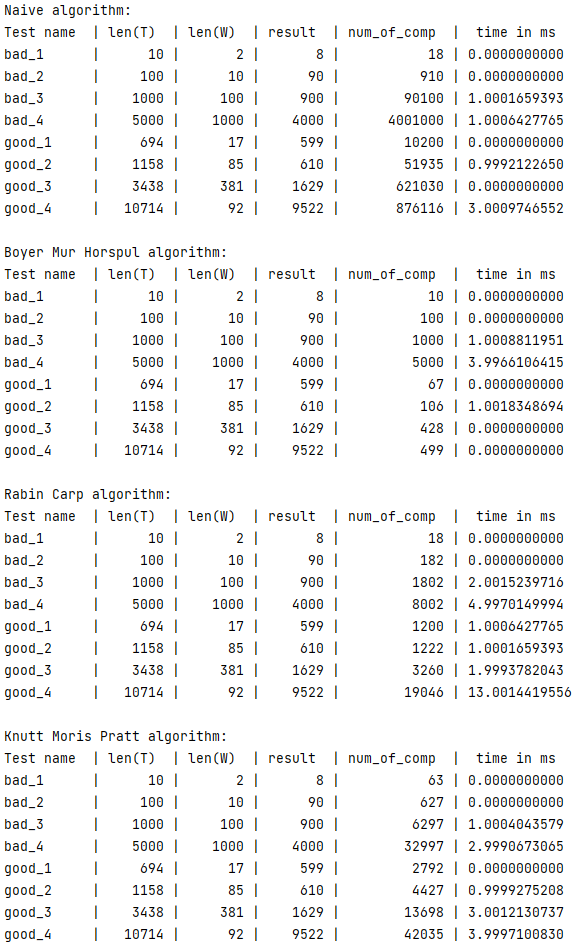

<h1>Отчет о лабе #1</h1>
<h3>Работу выполнили студенты 21ПМИ-2 Яров Тимур и Мальков Евгений</h3>

Мы реализовали четыре алгоритма: 
<ol>
<li>Наивный алгоритм</li>
<li>Алгоритм Бойера-Мура-Хорспула</li>
<li>Алгоритм Рабина-Карпа</li>
<li>Алгоритм Кнута-Морриса-Пратта</li>
</ol>

<h5>Вывод</h5>

Время работы всех алгоритмов приблизительно одинаковое, наблюдается лишь сильное отличие по количеству операций. Может показаться, что алгоритм Рабина-Карпа и алгоритм Кнута-Морриса-Пратта работают медленнее, но это вызвано большим количеством предварительных вычислений. 
