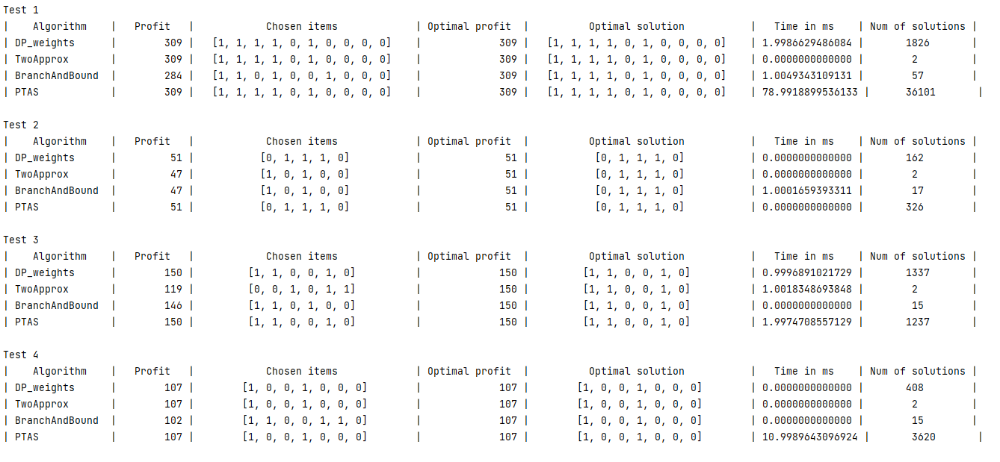
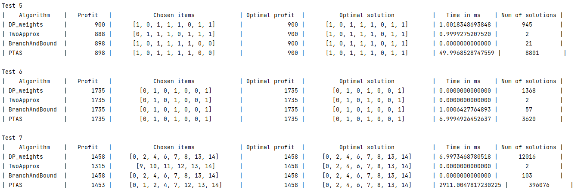

<h1>Отчет о лабе #2</h1>
<h3>Работу выполнили студенты 21ПМИ-2 Яров Тимур и Мальков Евгений</h3>

Мы реализовали четыре алгоритма: 
<ol>
<li>ДП по весам</li>
<li>2-approx</li>
<li>Метод <del>говна</del> ветвей и границ</li>
<li>PTAS</li>
</ol>

<h5>Вывод</h5>

Единственным точным методом в данной лабораторной работе - был метод динамического программирования, но на данном
наборе тестов он показал предпоследний перфоманс по времени. Так же этот алгоритм сильно ограничен входными данными. 

Самым точным и эффективным из эвристических методов оказался 2-approx. Но скорее всего это обусловлено удачными входными данными

Метод ветвей и границ оказался самым трудоемким в плане усилий, самым ошибочным и беспонтовым.

PTAS оказался самым долгим из всех эвристических алгоритмов, но при этом он гарантирует высокую точность ответа. k было выбрано равным 5, так как оно обеспечивает высокую точность и оптимальную производительность.
