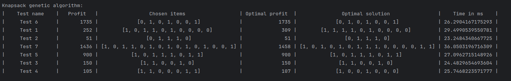
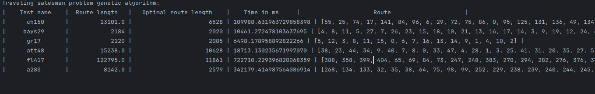

<h1>Отчет о лабе #3</h1>
<h3>Работу выполнили студенты 21ПМИ-2 Яров Тимур и Мальков Евгений</h3>

Мы реализовали два генетических алгоритма для задач о рюкзаке и о коммивояжере.

<h5>Вывод</h5>

Обе эти задачи являются NP-трудными, поэтому точные решения для них неэффективны по времени. Генетические
алгоритмы же позволяют вычислить приближенное решение этих задач за адекватное время. В случае задачи о рюкзаке
решения нашлись довольно точные и при этом поиск занял порядка 20 миллисекунд. Это достидимо только из-за маленького размера тестов.
В случае задачи о коммивояжере, здесь тесты оказались более серьезными, из-за чего точность реешния сильно упала, ровно как и увеличилось время работы.
