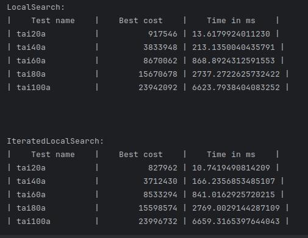

<h1>Отчет о лабе #3</h1>
<h3>Работу выполнили студенты 21ПМИ-2 Яров Тимур и Мальков Евгений</h3>

Мы реализовали local search и iterated local search

<h5>Вывод</h5>

Запуск производился на 20 итерациях, так как это количество по точности оказалось оптимальным.
Ответы алгоритмов достаточно схожи, но iterated local search все-таки немного выигрывает в точности
